<div align="center">

# 🔐 Fortress API

### *Enterprise-Grade User Management System*

**Secure • Scalable • Simple**

[](https://www.python.org/)
[](https://fastapi.tiangolo.com/)
[](LICENSE)
[](CONTRIBUTING.md)

*Built with ❤️ using modern Python and battle-tested security practices*

[Features](#-features) • [Quick Start](#-quick-start) • [Documentation](#-api-documentation) • [Security](#-security-architecture) • [Contributing](#-contributing)

---

</div>

## 🎯 Overview

**Fortress API** is a production-ready user management system that doesn't compromise on security. Built on FastAPI's lightning-fast framework, it provides everything you need to manage users with confidence: JWT authentication, role-based access control, and military-grade password hashing.

Whether you're building a startup MVP or an enterprise application, Fortress API gives you a solid foundation that scales with your needs.

### 🎬 Demo

```bash
# Login
curl -X POST http://localhost:8000/token \
  -d "username=admin@fortress.io&password=secure123"

# Get your profile
curl http://localhost:8000/me \
  -H "Authorization: Bearer eyJhbGc..."

# Create a new user
curl -X POST http://localhost:8000/users \
  -H "Authorization: Bearer eyJhbGc..." \
  -H "Content-Type: application/json" \
  -d '{"name":"Jane Doe","email":"jane@example.com","role":"user",...}'
```

---

## ✨ Features

<table>
<tr>
<td width="50%">

### 🔒 Security First
- **JWT Authentication** with access & refresh tokens
- **Argon2 Password Hashing** (PHC winner)
- **Role-Based Access Control** (RBAC)
- **Principal Protection** - unbreakable admin safeguards
- **Zero Password Exposure** in API responses

</td>
<td width="50%">

### 🚀 Developer Experience
- **Interactive API Docs** (Swagger & ReDoc)
- **Type-Safe** with Pydantic validation
- **Auto-Completion** support
- **Clean Architecture** - easy to extend
- **CSV Persistence** with auto-sync

</td>
</tr>
</table>

---

## 🏗️ Architecture

### Role Hierarchy

```mermaid
graph TD
    A[👑 Principal] --> B[🔧 Worker]
    B --> C[👤 User]
    A -.->|Full Control| D[All Operations]
    B -.->|Limited| E[View & Update]
    C -.->|Read Only| F[View Only]
```



### Permission Matrix

<div align="center">

| Operation | 👑 Principal | 🔧 Worker | 👤 User |
|-----------|:------------:|:---------:|:-------:|
| **View Users** | ✅ | ✅ | ✅ |
| **View Single User** | ✅ | ✅ | ✅ |
| **Create Users** | ✅ | ❌ | ❌ |
| **Update Basic Info** | ✅ | ✅ | ❌ |
| **Change Emails** | ✅ | ❌ | ❌ |
| **Manage Roles** | ✅ | ❌ | ❌ |
| **Delete Users** | ✅ | ❌ | ❌ |
| **Modify Principal** | 🔒 Protected | ❌ | ❌ |

</div>

---

## 🛡️ Security Architecture

### The Fortress Principles

```
┌─────────────────────────────────────────────────────────────┐
│  🏰 FORTRESS SECURITY LAYERS                                │
├─────────────────────────────────────────────────────────────┤
│                                                             │
│  Layer 1: JWT Authentication                                │
│  ├─ Access tokens (30 min expiry)                           │
│  ├─ Refresh tokens (7 days expiry)                          │
│  └─ Role embedded in token payload                          │
│                                                             │
│  Layer 2: Password Security                                 │
│  ├─ Argon2 hashing (memory-hard, GPU-resistant)             │
│  ├─ Automatic hashing on create/update                      │
│  └─ Zero password exposure in responses                     │
│                                                             │
│  Layer 3: Role-Based Access Control                         │
│  ├─ Three-tier role system                                  │
│  ├─ Per-endpoint role validation                            │
│  └─ Fine-grained permission checks                          │
│                                                             │
│  Layer 4: Principal Protection                              │
│  ├─ Single principal enforcement                            │
│  ├─ Deletion prevention                                     │
│  ├─ Role change blocking                                    │
│  └─ Self-modification only                                  │
│                                                             │
│  Layer 5: Email & Role Protection                           │
│  ├─ Email changes require principal                         │
│  ├─ Role changes require principal                          │
│  └─ No principal promotion allowed                          │
│                                                             │
└─────────────────────────────────────────────────────────────┘
```

### Security Rules

> 🔐 **The Principal is untouchable**
> - Only ONE principal exists in the system
> - Cannot be deleted by anyone (including himself/herself)
> - Can only be modified by himself/herself
> - No one can become principal after system initialization

---

## 🚀 Quick Start

### Prerequisites

- Python 3.8 or higher
- pip package manager
- A terminal and your favorite code editor

### Installation in 60 Seconds

```bash
# 1. Clone the fortress
git clone https://github.com/Zumboww/fortress-api.git
cd fortress-api

# 2. Create your environment
python -m venv venv
source venv/bin/activate  # Windows: venv\Scripts\activate

# 3. Install dependencies
pip install -r requirements.txt

# 4. Launch! 🚀
uvicorn system:sapp --reload
```

**That's it!** 🎉 Your API is now running at `http://127.0.0.1:8000`

### First Steps

1. **Visit the docs**: http://127.0.0.1:8000/docs
2. **Try the login** with your principal account
3. **Explore the endpoints** with the interactive UI

---

## 📚 API Documentation

### Authentication Flow

```python
# 1. Login to get tokens
POST /token
Body: username=admin@fortress.io&password=secure123

Response: {
  "access_token": "eyJhbGc...",
  "refresh_token": "eyJhbGc...",
  "token_type": "bearer",
  "role": "principal"
}

# 2. Use token in subsequent requests
GET /users
Header: Authorization: Bearer eyJhbGc...
```

### Core Endpoints

<details>
<summary><b>🔓 Public Endpoints</b></summary>

#### Login
```http
POST /token
Content-Type: application/x-www-form-urlencoded

username=user@example.com&password=securepass123
```

**Response:**
```json
{
  "access_token": "eyJhbGciOiJIUzI1NiIsInR5cCI6IkpXVCJ9...",
  "refresh_token": "eyJhbGciOiJIUzI1NiIsInR5cCI6IkpXVCJ9...",
  "token_type": "bearer",
  "role": "principal"
}
```

</details>

<details>
<summary><b>🔒 Protected Endpoints</b></summary>

#### Get Current User
```http
GET /me
Authorization: Bearer {token}
```

#### List All Users
```http
GET /users?length=10&offset=1
Authorization: Bearer {token}
```

#### Get Specific User
```http
GET /users/{user_id}
Authorization: Bearer {token}
```

#### Create User (Principal Only)
```http
POST /users
Authorization: Bearer {token}
Content-Type: application/json

{
  "name": "John Doe",
  "age": 28,
  "gender": "male",
  "email": "john@example.com",
  "password": "SecurePass123!",
  "role": "worker"
}
```

#### Update User (Principal, Worker)
```http
PUT /users/{user_id}
Authorization: Bearer {token}
Content-Type: application/json

{
  "name": "John Updated",
  "age": 29,
  ...
}
```

#### Partial Update (Principal, Worker)
```http
PATCH /users/{user_id}
Authorization: Bearer {token}
Content-Type: application/json

{
  "age": 30
}
```

#### Delete User (Principal Only)
```http
DELETE /users/{user_id}
Authorization: Bearer {token}
```

</details>

---

## 🎨 Project Structure

```
fortress-api/
│
├── 🎯 system.py                  # FastAPI app & route definitions
├── 🏢 system_service.py          # Business logic & data operations
├── 📋 system_scheme.py           # Pydantic models & validation
├── 🔐 system_utils.py            # JWT, hashing & auth utilities
├── ⚠️ system_exceptions.py      # Custom exception classes
├── 🔗 system_dependencies.py     # FastAPI dependency injection
│
├── 💾 users.csv                  # User database (CSV)
├── 📦 requirements.txt           # Python dependencies
├── 🚫 .gitignore                 # Git ignore rules
├── 📖 README.md                  # You are here!
└── 📜 LICENSE                    # MIT License
```

---

## 🔧 Configuration

### Environment Variables

Create a `.env` file in the root directory:

```bash
# JWT Configuration
JWT_SECRET_KEY=your-super-secret-key-change-this-in-production
JWT_REFRESH_SECRET_KEY=your-refresh-secret-key-also-change-this

# Token Expiry (in minutes)
ACCESS_TOKEN_EXPIRE_MINUTES=30
REFRESH_TOKEN_EXPIRE_MINUTES=10080  # 7 days

# Server Configuration
HOST=0.0.0.0
PORT=8000
```

> ⚠️ **Security Warning**: Always change the default JWT secrets in production!

### Initial Setup

Create your `users.csv` with the principal account:

```csv
name,age,gender,email,password,role
System Admin,35,male,admin@fortress.io,$argon2id$v=19$m=65536$...,principal
```

Generate hashed passwords:

```python
from passlib.context import CryptContext
pwd_context = CryptContext(schemes=["argon2"], deprecated="auto")
hashed = pwd_context.hash("your_password_here")
print(hashed)
```

---

## 🧪 Testing

### Manual Testing with cURL

```bash
# Get all users
curl -X GET "http://localhost:8000/users" \
  -H "Authorization: Bearer YOUR_TOKEN"

# Create a new worker
curl -X POST "http://localhost:8000/users" \
  -H "Authorization: Bearer YOUR_TOKEN" \
  -H "Content-Type: application/json" \
  -d '{
    "name": "Alice Worker",
    "age": 25,
    "gender": "female",
    "email": "alice@fortress.io",
    "password": "SecurePass123!",
    "role": "worker"
  }'

# Update user age
curl -X PATCH "http://localhost:8000/users/2" \
  -H "Authorization: Bearer YOUR_TOKEN" \
  -H "Content-Type: application/json" \
  -d '{"age": 26}'
```

### Using the Interactive Docs

1. Navigate to http://localhost:8000/docs
2. Click the **🔓 Authorize** button
3. Login with your credentials
4. Try any endpoint with one click!

---

## 🛠️ Technology Stack

<div align="center">

| Technology | Purpose | Why We Chose It |
|------------|---------|-----------------|
| **FastAPI** | Web Framework | Blazing fast, modern, type-safe |
| **Pydantic** | Data Validation | Automatic validation & serialization |
| **python-jose** | JWT Tokens | Industry-standard JWT implementation |
| **Passlib** | Password Hashing | Argon2 support (PHC winner) |
| **Polars** | CSV Operations | 10x faster than Pandas |
| **Uvicorn** | ASGI Server | Lightning-fast async server |

</div>

---

## 🚦 Roadmap

### Version 1.0 (Current) ✅
- [x] JWT authentication
- [x] Role-based access control
- [x] Password hashing (Argon2)
- [x] CSV persistence
- [x] Principal protection
- [x] Interactive API docs

### Version 1.1 (Planned) 🎯
- [ ] Rate limiting
- [ ] Audit logging
- [ ] Email verification
- [ ] Password reset flow
- [ ] Refresh token rotation
- [ ] API versioning

### Version 2.0 (Future) 🚀
- [ ] PostgreSQL/SQLite support
- [ ] User activity tracking
- [ ] Advanced search & filtering
- [ ] Export users (JSON/Excel)
- [ ] Bulk operations
- [ ] WebSocket notifications

---

## 🤝 Contributing

We love contributions! Whether it's:

- 🐛 Bug reports
- 💡 Feature suggestions
- 📝 Documentation improvements
- 🔧 Code contributions

### How to Contribute

1. **Fork** the repository
2. **Create** a feature branch (`git checkout -b feature/amazing-feature`)
3. **Commit** your changes (`git commit -m 'Add amazing feature'`)
4. **Push** to the branch (`git push origin feature/amazing-feature`)
5. **Open** a Pull Request

Please read our [CONTRIBUTING.md](CONTRIBUTING.md) for details.

---

## 📄 License

This project is licensed under the **MIT License** - see the [LICENSE](LICENSE) file for details.

```
MIT License - you can use this for anything, including commercial projects!
```

---

## 🌟 Show Your Support

If you found this project helpful, please consider:

- ⭐ **Starring** this repository
- 🐦 **Sharing** on social media
- 💬 **Providing feedback** via issues
- 🤝 **Contributing** to make it even better!

---

## 👨‍💻 Author

<div align="center">

**Mohammad Azim Memari**

[](https://github.com/Zumboww)
[](https://www.linkedin.com/in/mohammad-azim-memari-300348217/)
[](memoryaz98@gmail.com)

*Passionate about building secure, scalable systems*

</div>

---

## 🙏 Acknowledgments

- **FastAPI** team for the amazing framework
- **Passlib** maintainers for password hashing excellence
- The entire **Python** community
- Coffee ☕ - for making this possible

---

<div align="center">

### 🏰 Built with security in mind. Deploy with confidence.

**[⬆ Back to Top](#-fortress-api)**

---

*Made with ❤️ and Python • © December 2025 Mohammad Azim Memari*

</div>